# MLOps-Tutorial

## 1. Project Setup and Version Control:

- Create a new Google Cloud project.
  - Follow the steps to create a new project: https://console.cloud.google.com/projectcreate
  - Link a billing account to your google project
- Create a service account:
  - Go to https://console.cloud.google.com/
  - Click on IAM & Admin
    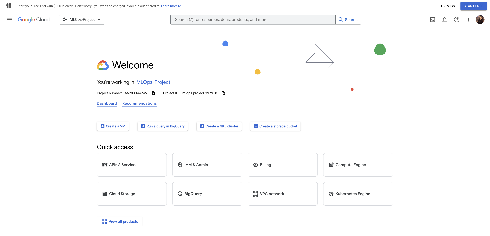
  - Click on Service Accounts
    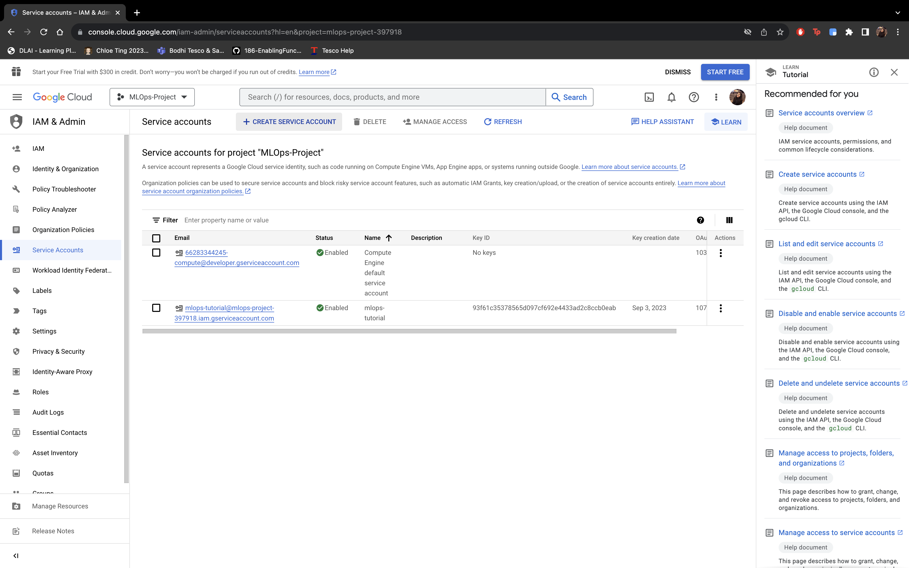
  - Create a new service account and give owner permission (for tutorial purpose)
    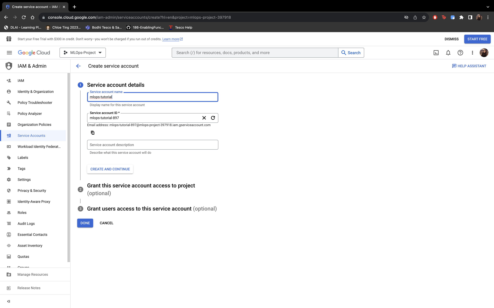
  - Once the account is created, click on the service account and go to KEYS and click on ADD KEY
    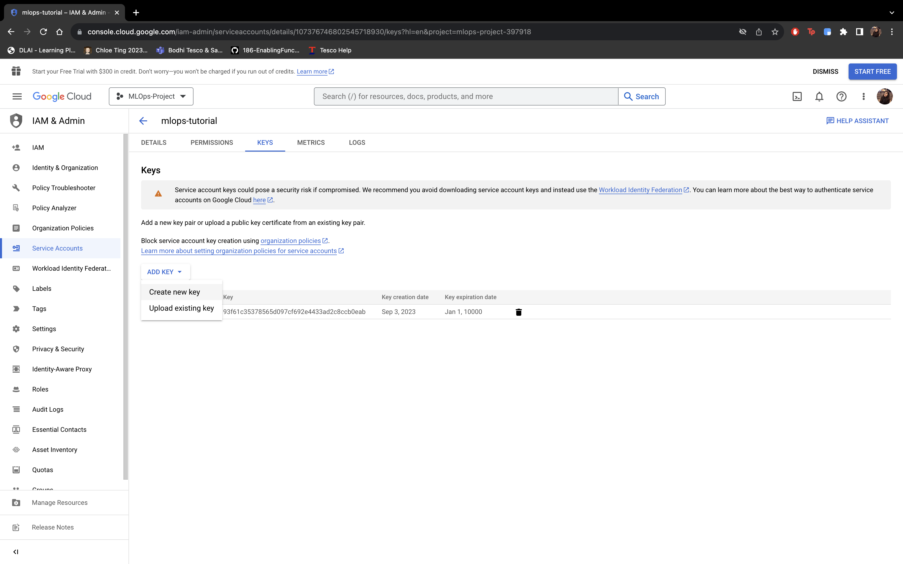
  - Create a json key and once you click on create a credentials json file will be downloaded.
    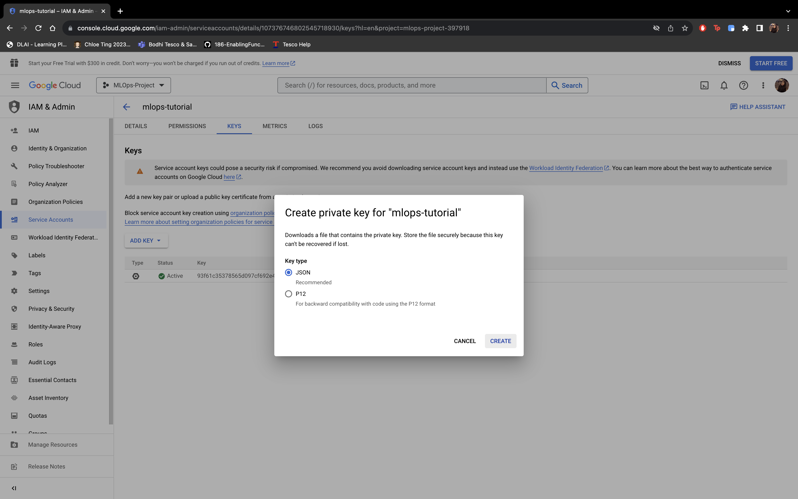
- Enable all the required APIs - 
  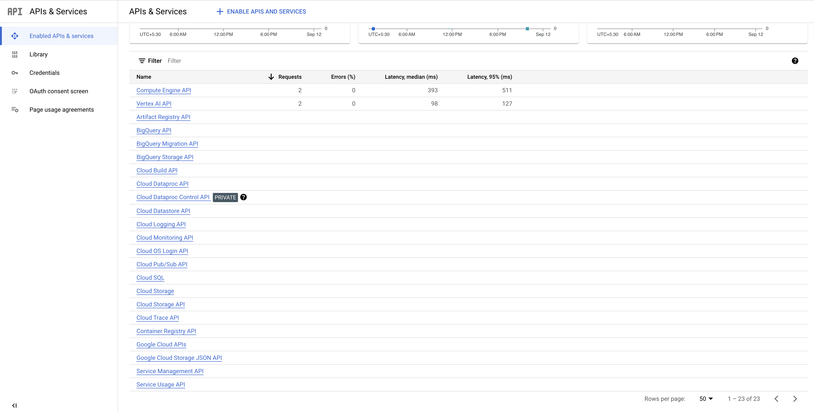
  - Cloud Dataproc API
  - Cloud Resource Manager API
  - Vertex AI API
  - Secret Manager API
  - Cloud Build API
  - IAM Service Account Credentials API
- Set up a version control repository for code and documentation.
  - Follow the steps to create new repository: https://docs.github.com/en/get-started/quickstart/create-a-repo
  - Clone the repository to your local

    ```sh
    git clone <repo-name>
    ```

## 2. Infrastructure as Code with Terraform

- Prerequisites:
  - Install Terraform: https://developer.hashicorp.com/terraform/downloads
  - Create a bucket with name `tf-state-prod-mlops` in GCP to store the terraform state.
    
    - Change bucket name in `provider.tf` to the bucket we just created.

  - Variables to change in `variable.tf`:
    - `project_id`: change it to you google project ID
    - `creds_file`: change it to the path to your gcp credentials.json file
    - `suffix`: change it to some other value for uniqueness

- Steps:
  - Create folder with name terraform.
  - Add service-account creds file and rename to `gcp-creds.json`.
  - Add train.csv file to data folder and preprocessing script to scripts folder.
  - Create `main.tf` file with resource definitions (Feature Store, Dataproc, Bigquery).
  - Create `variable.tf` to store all the values to be passed by the user.
  - Create `output.tf` save all the outputs to be used later on.
  - Deploy the infra by applying terraform files. (Or will be taken care of using cloudbuild)

>NOTE:The file paths needs to be changed based on operating system, current paths are based on MAC environment, for Windows change accordingly.

### Steps to run separately from cloudbuild

```sh
export GOOGLE_APPLICATION_CREDENTIALS="path/to/gcp-creds.json"
terraform init
terraform apply -auto-approve 
```

## 3. Data Preprocessing with Dataproc

- Write a Pyspark script for Dataproc pre-processing job `scripts/pyspark-preprocessing.py`.
- The script does two tasks:  
   1. Preprocess the data
   2. Save the output df to bigquery

### Steps to run separately from cloudbuild

- Use terraform to perform the following jobs:
- Create a Dataproc cluster.
- Create a GCP bucket and store the Pyspark script in it.
- Run a dataproc job for preprocessing and saving the processed data into bigquery.

  ```sh
  export GOOGLE_APPLICATION_CREDENTIALS="path/to/gcp-creds.json"
  terraform apply
  ```

## 4. Feature store

- Create feature store using terraform (done in milestone 1)
- Create ingestion jobs to fetch data from bigquery in `feature-store.py`.

### Steps to run separately from cloudbuild

- Set the following environment variables:  
  PROJECT_ID = os.environ.get("PROJECT_ID")
  REGION = os.environ.get("REGION")
  DATASET = os.environ.get("BQ_DATASET")
  SRC_TABLE = os.environ.get("BQ_TABLE")
  FEATURE_STORE_NAME = os.environ.get("FS_NAME")
  ENTITY_TYPE_ID = os.environ.get("FS_ENTITY_NAME")
- Run the following command in terminal:

  ```sh
  export GOOGLE_APPLICATION_CREDENTIALS="path/to/gcp-creds.json"
  python feature-store.py 
  ```

## 5. Setup CloudBuild

- Enable Secret Manager API
- Go to: https://console.cloud.google.com/cloud-build/repositories/2nd-gen 
- 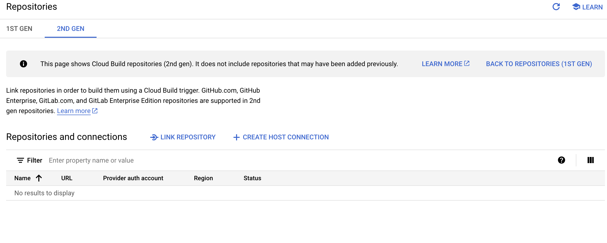
- Click on create host connection and fill the details(connect to your github account)
  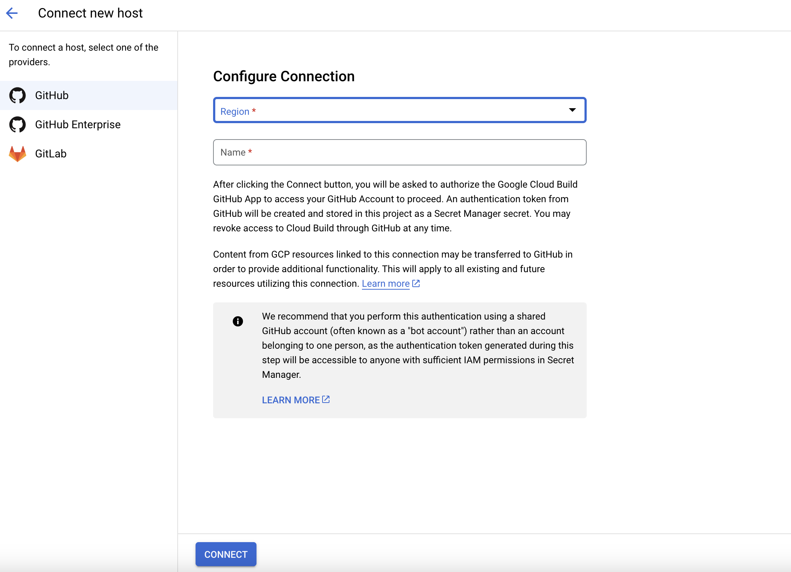
- Once done you should be able to see the connection
  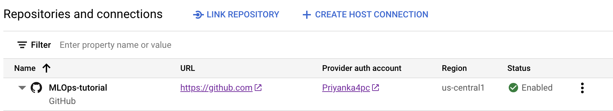
- Now click on Link Repository and select the repo to link for ci/cd
  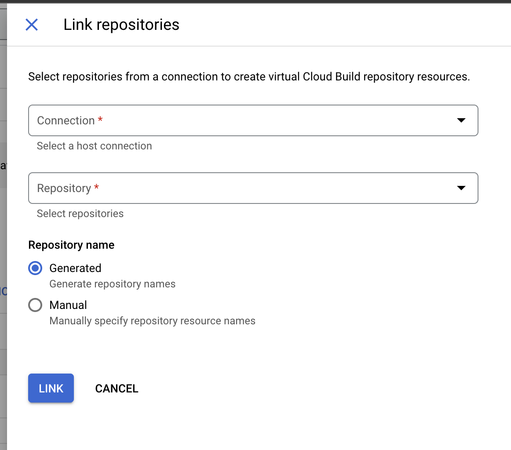
- Once done you should see 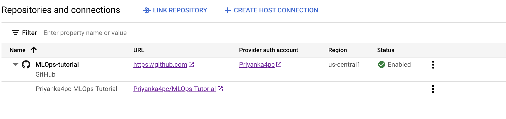
- Now go to https://console.cloud.google.com/cloud-build/triggers
- Click on Create Trigger and fill all the required info
  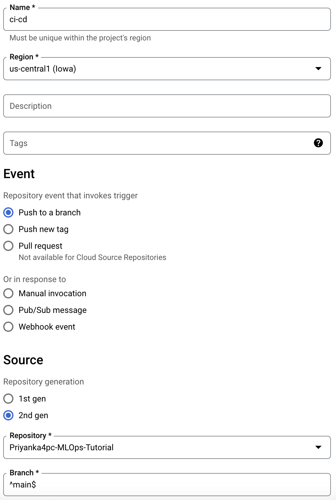
  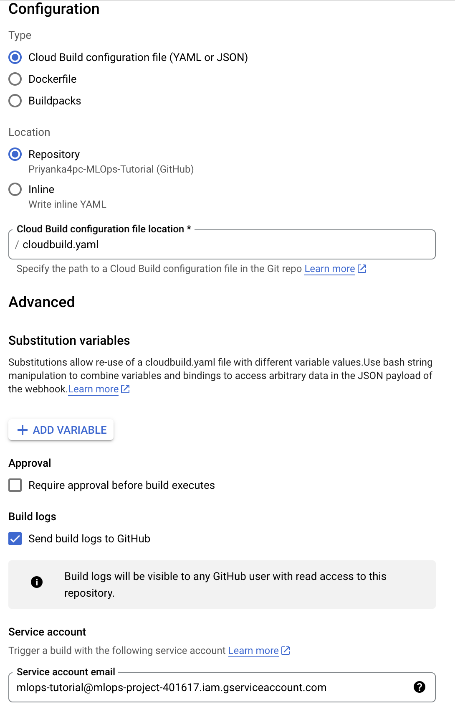
- Create a cloudbuild.yaml file in the github repo (steps mentioned in this file will be run in cloudbuild)
- Now commit the changes to github, on every commit a cloudbuild pipeline will be triggered.
  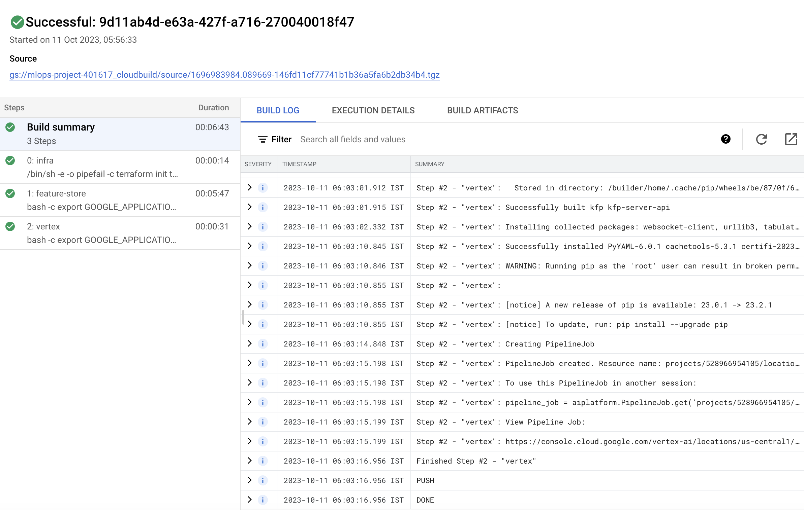

## 6. Pipeline Creation

- Create a vertex pipeline with 3 steps
  - fetch features from feature store
  - train model
  - deploy model
- In cloudbuild.yaml change the service account name
- Once the cloudbuild pipeline runs, the vertex pipeline will be triggered
 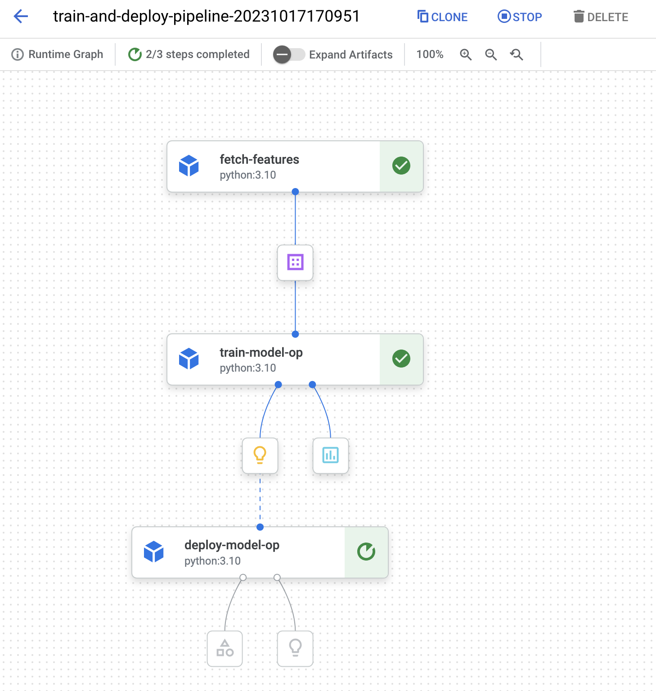
- Wait for the pipeline to complete. Once the pipeline completes, you can see the model deployed on the endpoint which can be used for inferencing.
 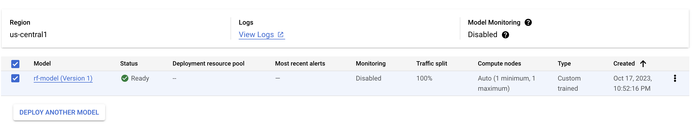
