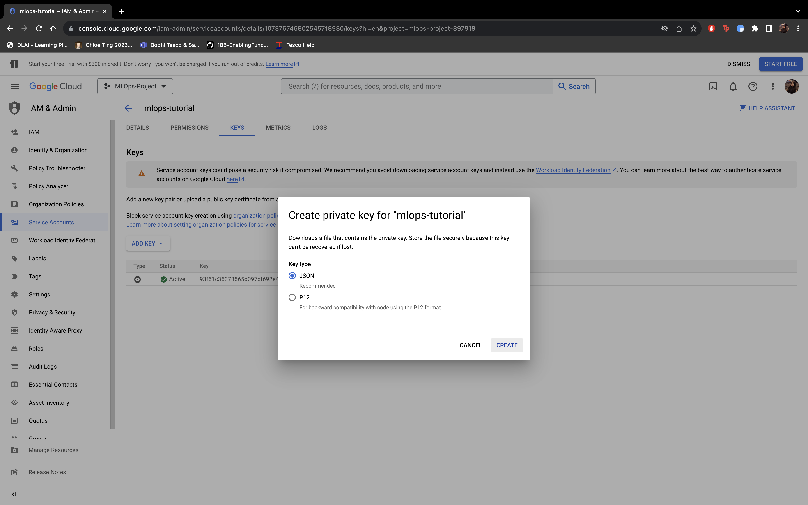
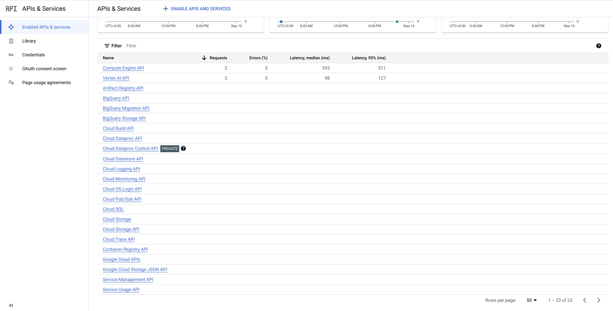
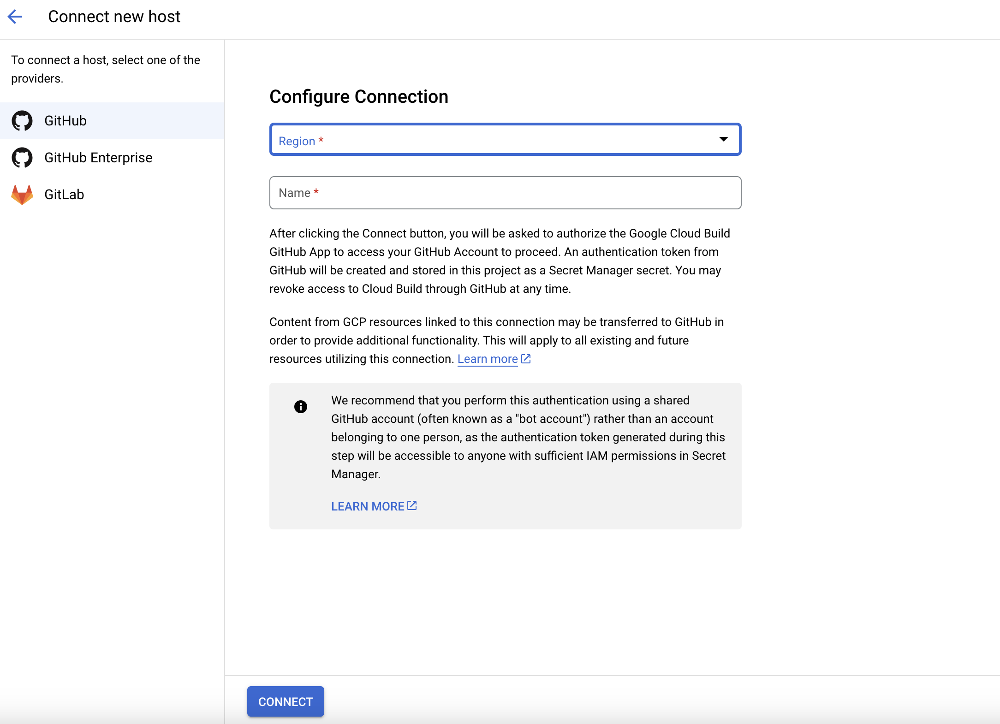
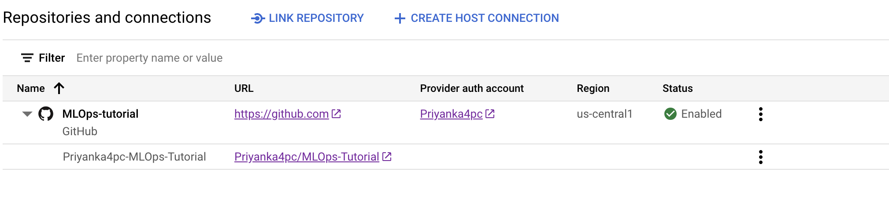
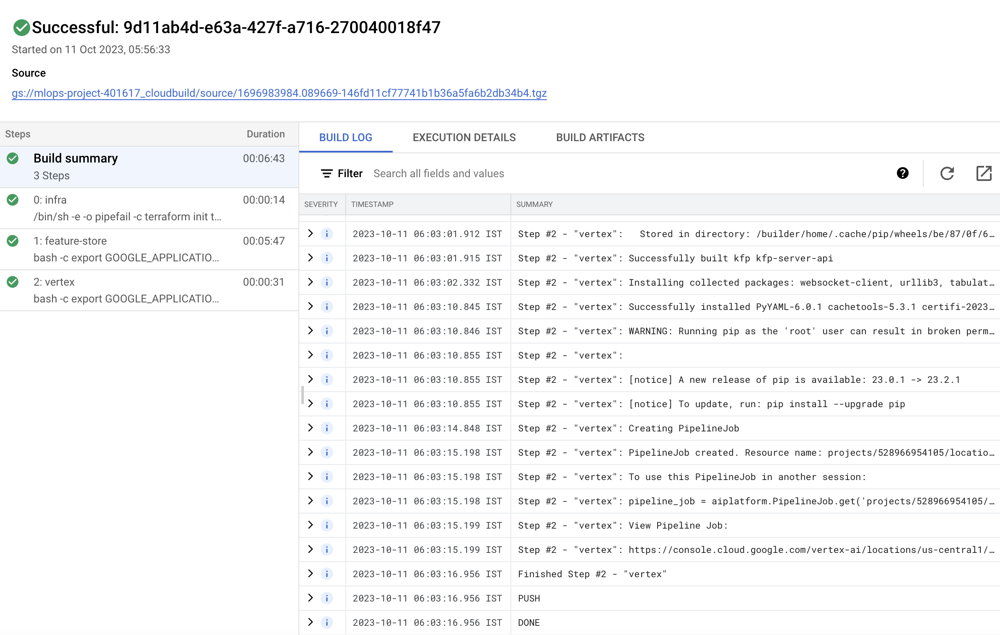

# MLOps-Tutorial

## 1. Project Setup and Version Control:

- Create a new Google Cloud project.
  - Follow the steps to create a new project: https://console.cloud.google.com/projectcreate
  - Link a billing account to your google project
- Create a service account:
  - Go to https://console.cloud.google.com/
  - Click on IAM & Admin
    
  - Click on Service Accounts
    
  - Create a new service account and give owner permission (for tutorial purpose)
    
  - Once the account is created, click on the service account and go to KEYS and click on ADD KEY
    
  - Create a json key and once you click on create a credentials json file will be downloaded.
    
- Enable all the required APIs - 
  
  - Cloud Resource Manager API
  - Vertex AI API
  - Secret Manager API
  - Cloud Build API
  - IAM Service Account Credentials API
  - IAM API
  - Cloud Functions API
  - Cloud Pub/Sub API
  - Eventarc API
  - Compute Engine API
  - Cloud Run Admin API
    ```sh
    gcloud auth login
    gcloud config set project $PROJECT_ID
    gcloud services enable cloudresourcemanager.googleapis.com aiplatform.googleapis.com secretmanager.googleapis.com cloudbuild.googleapis.com iamcredentials.googleapis.com iam.googleapis.com cloudfunctions.googleapis.com pubsub.googleapis.com eventarc.googleapis.com compute.googleapis.com run.googleapis.com
    ```

- Set up a version control repository for code and documentation.
  - Follow the steps to create new repository: https://docs.github.com/en/get-started/quickstart/create-a-repo
  - Clone the repository to your local

    ```sh
    git clone <repo-name>
    ```

- Authenticate with gcp:
  - Add service-account creds file and rename to `gcp-creds.json`.

  ```sh
  export GOOGLE_APPLICATION_CREDENTIALS="path/to/gcp-creds.json"
  ```

## 2. Infrastructure as Code with Terraform

- Prerequisites:
  - Install Terraform: https://developer.hashicorp.com/terraform/downloads
  - Create a bucket with name `tf-state-mlops` in GCP to store the terraform state. (Change the bucket name if not available)
    
    ```sh
    gcloud storage buckets create gs://tf-state-mlops-tut  --location=us-central1
    ```


### Changes to be made

- Change bucket name in `provider.tf` to the bucket we just created.
- Variables to change in `variable.tf`:
  - `project_id`: change it to you google project ID
  - `suffix`: change it to some other value for uniqueness
  - `service_account`: change it to the name of your service account

>NOTE: The file paths needs to be changed based on operating system, current paths are based on MAC environment, for Windows change accordingly.

## 3. Setup Cloudbuild

- Enable Secret Manager API
- Go to: https://console.cloud.google.com/cloud-build/repositories/2nd-gen 
- 
- Click on create host connection and fill the details(connect to your github account)
  
- Once done you should be able to see the connection
  
- Now click on Link Repository and select the repo to link for ci/cd
  
- Once done you should see 
- Now go to https://console.cloud.google.com/cloud-build/triggers
- Click on Create Trigger and fill all the required info
  
  
- Now commit the changes to github, on every commit a cloudbuild pipeline will be triggered.
  

## 4. Monitoring and Notification Channel

- Add Pub/Sub publisher role to this service account:
  `service-PROJECT_NUMBER@gcp-sa-monitoring-notification.iam.gserviceaccount.com`
  
- Alert to Notification Channel needs to be done manually, since SDK doesn't support that as of now. It can only be done when the monitoring pipeline is in running state. The current monitoring pipeline takes around 2hrs 30mins to calculate the baseline.
  

- Once this setting is updated we can create predictions with drifted features and see the alerts in next monitoring pipeline.
- Once an alert is created the retraining pipeline is triggered which will train on the new data + test data and deploy a new version of the model and update the monitoring job for the new model. It'll again calculate the baseline and then will transition from updating state to running state.
- 1000 monitoring requests are required for the monitoring pipeline to calculate the schema.